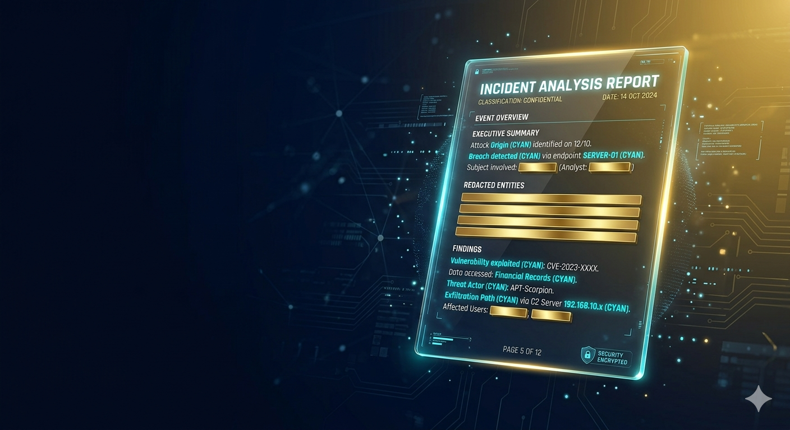
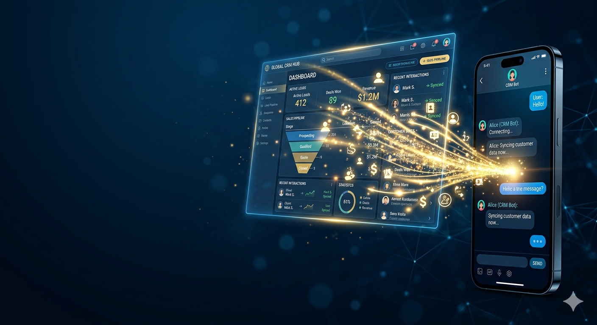

<!--
**deniskosminai/deniskosminai** is a ✨ _special_ ✨ repository because its `README.md` (this file) appears on your GitHub profile.

Here are some ideas to get you started:

- 🔭 I’m currently working on ...
- 🌱 I’m currently learning ...
- 👯 I’m looking to collaborate on ...
- 🤔 I’m looking for help with ...
- 💬 Ask me about ...
- 📫 How to reach me: ...
- 😄 Pronouns: ...
- ⚡ Fun fact: ...
-->

## 🧑‍💻 Про меня / About Me

Объединяю редкое сочетание:  большой опыт управления и глубокую экспертизу в стратегическом маркетинге, SMM, инженерной AI‑разработке. 
Хорошо понимаю цели и задачи как оффлайн так и  онлайн  бизнеса ( e‑commerce и инфобизнеса) выстраиваю воронки продаж и SMM‑продвижение.

- **Мой подход:** Я смотрю на автоматизацию глазами операционного директора. Меня интересует не просто «красота кода», а его отказоустойчивость, влияние на P&L и масштабируемость без роста ФОТ.
- **Мост между бизнесом и IT:** Перевожу цели собственника на язык надежной архитектуры. Знаю, где ИИ принесет деньги, а где станет «дорогой игрушкой».
- **Production-ready:** 30+ реализованных проекта. 15+ внедрений в закрытых локальных контурах (On-Premise).

---

## 🛠️ Стек и технологии / Tech Stack

**Core Expertise:**
- **AI Architecture:** RAG (ChromaDB, Pinecone, Weaviate, SQLite, Qdrant, FAISS, RAGAS), Agentic AI (LangGraph)
- **LLM Expertise:** Claude (ClaudeCode), GPT-5, GigaChat Pro, YandexGPT, Gemini, DeepSeek, Qwen.
- **LLM multimodal:** Whisper, Edge TTS, FLUX.1, SDXL
- **Languages & Backend:** Python (FastAPI, Flask), SQL, Docker, API Orchestration, LangChain.
- **Prompt Engineering:** Разработка и оптимизация сложных системных промтов с  мета-когнитивной проверкой
                          и валидацией вывода  (JSON/Pydantic), исключающей ошибки в логике.

**Workflow & Reliability:**
- **No-code/Low-code:** n8n (локально/облако), Albato, Salebot.
- **Validation:** Pydantic / Instructor (строгая типизация данных ИИ).
- **Monitoring:** Langfuse (LLM Observability), семантическое кэширование (SQLite), GitHub Actions, Docker Compose.

**Busines & Marketing:**
- **Busines:** ISO 9001, 152-ФЗ/44-ФЗ/223-ФЗ, Ozon/WB API
- **Marketing:** SWOT, CJM

---

## 📂 Витрина решений / Showcase (Top 5)

*Ниже представлены архитектурные разборы ключевых систем. Исходный код большинства проектов защищен NDA.*

1. [**enterprise-rag-152fz**] — Корпоративная база знаний: On-Premise deployment, точность 80% (RAGAS).
2. [**n8n-crm-sync-gmu**] — Промышленный паттерн синхронизации CRM без дублей (Get-Merge-Update).
3. [**ai-content-factory-jsdom**] — Контент-завод с 50-кратной экономией на API токенах.
4. [**vision-ai-ecom-pipeline**] — Автоматизация карточек товаров: из фото в Excel за 30 сек.
5. [**llm-observability-audit**] — Фреймворк мониторинга и оптимизации затрат (Langfuse).

<table border="0">
  <tr>
    <!-- КЕЙС 1 -->
    <td width="33%" align="center">
      
       <b>Enterprise RAG: On-Premise</b>
    </td>
    <!-- КЕЙС 2 -->
    <td width="33%" align="center">
      
       <b>n8n CRM Sync (GMU Pattern)</b>
    </td>
  </tr>
  <tr>
    <!-- КЕЙС 3 -->
    <td width="33%" align="center">
      
       <b>AI Content Factory: 50x Token Economy</b>
    </td>
    <!-- КЕЙС 4 -->
    <td width="33%" align="center">
      
       <b>Vision AI E-com Pipeline</b>
    </td>
  </tr>
</table>
---

## 📈 Измеримые результаты / Hard Stats

- **30x** ускорение процессов подготовки данных для E-commerce.
- **-40%** снижение расходов на API за счет рефакторинга промптов и кэширования.
- **0** дубликатов в базах данных после внедрения моих паттернов синхронизации.
- **80%+** точность ответов в RAG-системах (верифицировано метриками Faithfulness).

---

## 📌 Как я работаю / Methodology

1. **Аудит и Анализ:** Сначала изучаю ваши бизнес-метрики (ROI, ФОТ) и текущую архитектуру.
2. **Проектирование:** Рисую схему решения, исключающую «костыли» и технический долг.
3. **Реализация:** Сборка системы (n8n/Python) со строгой валидацией данных (Pydantic/JSON).
4. **Контроль:** Внедрение мониторинга качества ответов и затрат.

---

## 📩 Контакты / Contacts

- **Telegram:** [@dks_persistent_bot](https://t.me/dks_persistent_bot) — *Записаться на аудит или обсудить субподряд.*
- **LinkedIn:** [Ваша ссылка]
- **Официальный статус:** ИП / Самозанятый (Договор, NDA, DPA).
